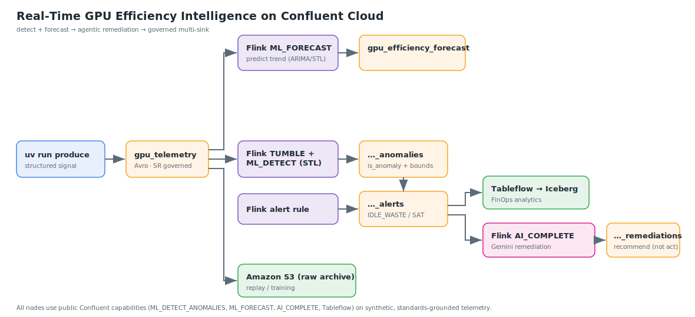

# Real-Time GPU Cost Governance on Confluent Cloud

[](https://github.com/Lutflow/gpu-efficiency-streaming/actions/workflows/ci.yml)
[](LICENSE)
[](https://www.confluent.io/)

Catch **idle-but-allocated GPU** and **saturation** in an LLM inference fleet **in real time** and turn
the energy-per-useful-work signal into **GPU cost governance** — using 100% Confluent Cloud:
**producer/bridge → Flink (`TUMBLE` + `ML_DETECT_ANOMALIES`, ARIMA/STL, plus `ML_FORECAST`) → Amazon
S3**, governed by **Schema Registry** and visualized in **Stream Lineage**.

> **📊 Measured case study:** this pipeline was run against a **real IBM Granite 3.3-8B Instruct
> deployment on a real NVIDIA L4** (vLLM + NVIDIA DCGM, 100% real telemetry). Measured **efficiency
> frontier** across a concurrency sweep: **173 J/1k tokens at concurrency 32, rising ~27× to 4 639 at
> concurrency 1, and `NULL` (maximum waste) at idle** — see
> [`case-studies/granite-3.3-8b-l4/`](case-studies/granite-3.3-8b-l4/) (raw data + plot + reproduction
> included). The synthetic producer below is the **reproducible quickstart (no GPU required)**.

**📓 Technical + business lab notebook:** [`case-studies/granite-3.3-8b-l4/analysis.ipynb`](case-studies/granite-3.3-8b-l4/analysis.ipynb)
— the full analysis (efficiency frontier, dual-method power cross-check, cost model) rendered with
outputs, reproducible offline from the committed data.

**🔬 Comparative study:** the same L4 sweep was also run on **Mistral-7B-Instruct-v0.3** — see the
[comparison](case-studies/granite-3.3-8b-l4/#comparison--granite-33-8b-vs-mistral-7b-instruct-v03-on-the-same-l4)
(Mistral-7B ~12-14% lower J/1k; smaller model → higher throughput at the same ~72 W).

**📐 Pipeline walkthrough:** [`pipeline/PIPELINE.md`](pipeline/PIPELINE.md) — a component-by-component
tour with **live screenshots** (Stream Lineage closed loop, each Flink statement, the S3 connector,
remediation output, Schema Registry `BACKWARD`).

The anomaly-detection and forecasting models run *inside* Flink SQL — there is no separate
model-serving infrastructure to operate.

## Why this matters

A large share of GPU inference spend is wasted on GPUs that are **allocated but idle**. By the time a
nightly FinOps batch job surfaces it, the money is already gone. This pipeline flags the waste the
moment it appears in the telemetry stream, and lands an actionable anomaly record you can route to a
data lake or downstream consumers.

The efficiency KPI it emits — `joules_per_1k_tokens`, an energy-per-useful-work unit computed from a
DCGM-style energy counter divided by generated tokens — is the kind of unit a platform team can put a
dollar figure on. (In this demo the telemetry is a structured synthetic signal, not measured hardware
— see *What's synthetic* below.)

## Architecture



*The SVG shows the core branches; the **full closed loop** (waste detector → rule-based remediation)
is in the ASCII diagram below and walked through component-by-component in
[`pipeline/PIPELINE.md`](pipeline/PIPELINE.md).*

```text
uv run produce  →  gpu_telemetry (Avro, Schema Registry)
   │
   ├─→ [Flink ML_FORECAST]  → gpu_efficiency_forecast
   │        → [Flink capacity rule]  → gpu_efficiency_capacity_risk (PREDICTED_IDLE) → [Amazon S3 Sink]
   │
   ├─→ [Flink TUMBLE 15s + ML_DETECT_ANOMALIES (ARIMA, STL)]  → gpu_efficiency_anomalies
   │        ├─→ [Flink alert rule] → gpu_efficiency_alerts (IDLE_WASTE / SATURATION) → [Amazon S3 Sink]
   │        └─→ [08 waste detector: high util / low useful tput] → gpu_efficiency_waste
   │        alerts ∪ waste → [09 rule-based remediation, no LLM] → gpu_remediation
   │
   └─→ [Amazon S3 Sink]  → raw telemetry archive (replay / training)
```

The pipeline pairs Confluent's two built-in Flink ML functions — **`ML_DETECT_ANOMALIES`** (with
Seasonal-Trend decomposition, `enableStl`) to flag waste *now*, and **`ML_FORECAST`** to *predict*
low-utilization windows ahead — and lands every branch in a governed **Amazon S3** sink. It renders in
**Stream Lineage** as a tree, not a line. Every node uses a public Confluent capability on the generic,
standards-grounded telemetry contract; nothing proprietary.

The detection path **closes a loop**: a cheap deterministic waste detector (`08`, high utilization but
low *useful* throughput) joins the idle/saturation alerts, and a **rule-based remediation recommender**
(`09`, no LLM) turns them into a `recommended_action` per deployment — see the live walkthrough in
[`pipeline/PIPELINE.md`](pipeline/PIPELINE.md) and the measured
[case study](case-studies/granite-3.3-8b-l4/README.md).

## Agent-ready

The pipeline emits **governed, structured signals** rather than dashboards: anomaly records from
`ML_DETECT_ANOMALIES` (waste happening *now*), predictive `capacity_risk` records from `ML_FORECAST`
(waste *about to* happen), and a `08` waste detector (high utilization, low *useful* throughput).

**The loop already closes today.** A **deterministic, rule-based remediation recommender**
(`09_remediation.sql`, **no LLM**) consumes the alerts ∪ waste streams and emits a `recommended_action`
plus an *illustrative* reclaimable-$ figure per deployment, written back as another governed stream —
reference-aligned with the **Confluent Streaming Agents** pattern (rightsize, consolidate, scale out,
alert an owner).

**No LLM is deployed in the live pipeline** — the recommender is deterministic on purpose (auditable,
cheap, reproducible). The natural upgrade — an in-stream `AI_COMPLETE` (or a full Streaming Agent) that
*reasons* over an alert plus deployment context — remains **roadmap**: an honest exploration with
Flink's `AI_COMPLETE` (Gemini) lives in [`experimental/`](experimental/), not deployed because
`AI_COMPLETE` is non-deterministic and Flink rejects it over the changelog streams this pipeline
produces. A production upgrade would use Confluent **Streaming Agents** for that step.

## Cost & region

This demo provisions **billable** Confluent Cloud resources: a **Standard** Kafka cluster, a Flink
compute pool, and three Amazon S3 sink connectors. They bill for as long as they run, and the built-in
Flink ML functions (`ML_DETECT_ANOMALIES`, `ML_FORECAST`) are billed in **CFUs** as part of compute-pool
usage. **Run [`uv run destroy`](#run-it-two-commands) as soon as you're done** to stop the meter. See
[Confluent Cloud pricing](https://www.confluent.io/confluent-cloud/pricing/) and
[Flink billing](https://docs.confluent.io/cloud/current/flink/concepts/billing.html).

The full closed loop runs **six Flink statements** (detect, alerts, forecast, capacity-risk, waste,
remediation), so the compute pool is sized at **`max_cfu = 10`** (more CFUs than the base detect/forecast
set) — the meter is correspondingly higher, which is one more reason to **tear down promptly** after a
run.

A **Standard** cluster is required — Basic does not support the topic-scoped RBAC this project uses
([cluster types](https://docs.confluent.io/cloud/current/clusters/cluster-types.html)). Deploy in a
cloud/region where Flink and the built-in ML functions are available; this was tested on **AWS
`us-east-1`**.

## Run it (two commands)

Prerequisites: a [Confluent Cloud](https://confluent.cloud) account, [Terraform](https://www.terraform.io/) ≥ 1.6,
[`uv`](https://docs.astral.sh/uv/), and an AWS account with an S3 bucket.

```bash
# 1. Provide credentials (never committed — terraform.tfvars is gitignored)
cp terraform/terraform.tfvars.example terraform/terraform.tfvars
$EDITOR terraform/terraform.tfvars   # Confluent + AWS

# 2. Stand up infra + Flink statements + sinks
uv run deploy

# 3. Feed the pipeline with the structured synthetic signal
uv run produce            # streams correlated telemetry into gpu_telemetry

# 4. ...screenshot the printed Stream Lineage URL once the ML warms up (~7-8 min)

# 5. Tear it all down
uv run destroy
```

`uv run deploy` runs `terraform apply` (environment, Standard cluster, Schema Registry subject, Flink
compute pool, the Flink statements, and the sinks). `uv run produce` then streams the structured signal
into `gpu_telemetry`. The Flink SQL lives in [`flink/`](flink/) and is the single source of truth.

> **Warmup:** detection runs with a 15s tumbling window, `minTrainingSize=30`, Seasonal-Trend
> decomposition (`enableStl=true`, `m=12`), so the first anomalies appear after roughly 30 windows
> (~7-8 minutes). `ML_FORECAST` (which needs more history) starts emitting a little later.

## What's synthetic vs. production

The telemetry in this demo is **synthetic but structured**. It **models an IBM Granite 3.3-8B Instruct
inference deployment running on NVIDIA L4 GPUs** — it *models* that workload, it does **not measure**
real hardware. A small producer
([`src/gpu_efficiency_streaming/produce.py`](src/gpu_efficiency_streaming/produce.py), run with
`uv run produce`) emits a **temporally structured signal** — a diurnal/sawtooth utilization duty cycle
plus noise, with randomly injected *idle episodes* — and the dependent fields are **physically
correlated** (power tracks utilization toward the L4 TDP, token counters advance faster when busy, the
energy counter integrates power, latency rises under saturation). This is what gives the ML something
real to detect and forecast — but it is still a **synthetic signal, not a measurement**. The **schema is
standards-grounded**: every field maps 1:1 to a real, public metric from **vLLM** (Prometheus v1), the
**NVIDIA DCGM exporter**, and **OpenTelemetry** semantic conventions (GenAI + Hardware/GPU). See the
provenance table below.

To run against a **real fleet**, replace the producer with an **OpenTelemetry Collector** (Prometheus
scrape of vLLM `/metrics` + the DCGM exporter) or a Prometheus→Kafka bridge. **The schema and the entire
Flink/ML/Sink pipeline stay identical** — that is what makes this translation-ready rather than a toy.

### Schema provenance

| Avro field | vLLM (Prometheus v1) | NVIDIA DCGM exporter | OpenTelemetry semconv |
|---|---|---|---|
| `gpu_util_pct` | — | `DCGM_FI_DEV_GPU_UTIL` | `hw.gpu.utilization` |
| `sm/tensor/dram_active_ratio` | — | `DCGM_FI_PROF_{SM,PIPE_TENSOR,DRAM}_ACTIVE` | (hw.gpu.* extended) |
| `power_watts` / `energy_mj` | — | `DCGM_FI_DEV_POWER_USAGE` / `_TOTAL_ENERGY_CONSUMPTION` | `hw.power` / `hw.energy` |
| `temp_celsius` | — | `DCGM_FI_DEV_GPU_TEMP` | `hw.temperature` |
| `num_requests_running/waiting` | `vllm:num_requests_{running,waiting}` | — | — |
| `kv_cache_usage_perc` | `vllm:kv_cache_usage_perc` | — | — |
| `prompt/generation_tokens_total` | `vllm:{prompt,generation}_tokens_total` | — | `gen_ai.client.token.usage` |
| `ttft_seconds` | `vllm:time_to_first_token_seconds` | — | `gen_ai.server.time_to_first_token` |
| `inter_token_latency_s` (TPOT) | `vllm:inter_token_latency_seconds` | — | `gen_ai.server.time_per_output_token` |
| `e2e_latency_seconds` | `vllm:e2e_request_latency_seconds` | — | `gen_ai.server.request.duration` |

## Example output

Real records captured from a live run — see [`examples/sample-output.md`](examples/sample-output.md).
A representative `gpu_efficiency_alerts` row:

```json
{"window_start": "2026-06-15T10:21:30-04:00", "avg_gpu_util": 7.33, "expected_util": 51.21, "lower_bound": 12.96, "upper_bound": 89.47, "is_anomaly": true, "efficiency_flag": "IDLE_WASTE"}
```

Read it as: measured `avg_gpu_util = 7.33` while ARIMA expected `≈ 51.2` (normal range `[12.96, 89.47]`)
— below the lower bound, so an allocated-but-idle GPU is flagged `IDLE_WASTE`. The forecast branch
emits the same shape ahead of time as `PREDICTED_IDLE` in `gpu_efficiency_capacity_risk`.

The headline KPI **`joules_per_1k_tokens`** (energy per useful work) is captured live in
`gpu_efficiency_anomalies` — efficient windows run **~29 J/1k tokens** (`avg_gpu_util ≈ 55`), low-utilization
windows climb to **71-96 J/1k** (`util ≈ 8-15`), and a **fully idle** window (`gen_tokens_win = 0`) emits
`NULL` — energy burned for *zero* useful tokens, i.e. undefined cost-per-work = maximum waste. Full rows
and interpretation in [`examples/sample-output.md`](examples/sample-output.md#gpu_efficiency_anomalies--energy-efficiency-kpi).

## Repository layout

```text
schemas/gpu_telemetry.avsc      # public, standards-grounded Avro schema
scripts/datagen_schema.json     # documented reference for a Datagen Source (NOT the deployed source)
src/gpu_efficiency_streaming/
  produce.py                    # `uv run produce` — structured-signal telemetry producer (quickstart)
  bridge.py                     # `uv run bridge` — real vLLM+DCGM -> Avro bridge (measured case study)
  deploy.py / destroy.py        # `uv run deploy` / `uv run destroy`
flink/                          # the SQL pipeline (single source of truth)
  README.md                     #   DAG walkthrough + per-statement reference
  01a_add_event_time.sql        #   computed event_time column (TO_TIMESTAMP_LTZ)
  01b_set_watermark.sql         #   event-time watermark on event_time
  02_detect_anomalies.sql       #   TUMBLE 15s + ML_DETECT_ANOMALIES (ARIMA + STL)
  03_alerts.sql                 #   IDLE_WASTE / SATURATION business rule
  05_forecast.sql               #   ML_FORECAST — predict the efficiency trend
  07_capacity_risk.sql          #   PREDICTED_IDLE from the forecast (next window)
  08_waste_high_util.sql        #   "utilization-lies" waste detector (high util, low useful throughput)
  09_remediation.sql            #   rule-based remediation recommender (closes the loop; no LLM)
terraform/                      # all infrastructure + sinks + Flink statements
experimental/                   # NOT deployed: an AI_COMPLETE (Gemini) remediation exploration
examples/                       # real captured ML output (examples/sample-output.md)
case-studies/                   # MEASURED: real Granite-3.3-8B/L4 run (real data + reproduction)
tests/                          # schema + datagen + producer validation (pytest)
```

## Design notes

- **Single deployment in the demo.** `ML_DETECT_ANOMALIES` is used as an `OVER (ORDER BY window_time …)`
  window function with **no `PARTITION BY`** — matching the documented pattern exactly. This guarantees
  the statement validates, and makes the within-window counter delta (`MAX − MIN`) semantically valid on
  a single stream.
- **Seasonal-Trend detection.** `ML_DETECT_ANOMALIES` runs with `enableStl=true`, `m=12`, and
  `minTrainingSize=30`, so it learns the diurnal duty cycle and flags *unexpected* idle/saturation
  rather than the predictable daily trough. With a 15-second window that puts the warmup at ~7-8 minutes.
- **Predictive capacity-risk branch.** A parallel `ML_FORECAST(...)` (`horizon=1`, `enableStl=true`,
  `m=12`) projects the next window's utilization off `gpu_telemetry`; `07_capacity_risk.sql` reads the
  forecast array (`fc[1].forecast_value`) and emits a `PREDICTED_IDLE` record when the projected
  utilization falls below threshold — waste flagged *before* it happens.
- **Robust event time.** `ts` is carried as a plain epoch-millis `long` (no Avro logical type, so the
  pipeline never depends on the source connector preserving it). Flink derives an event-time attribute
  with a computed column — `ALTER TABLE gpu_telemetry ADD event_time AS TO_TIMESTAMP_LTZ(ts, 3)` — and a
  separate `MODIFY WATERMARK FOR event_time` (Confluent Flink runs one statement at a time, so these are
  two statements). `TUMBLE` then windows on `DESCRIPTOR(event_time)`.
- **Changelog mode.** `ML_DETECT_ANOMALIES` as an unbounded `OVER` aggregation emits an updating
  (retract) changelog, so the result tables are created **without** forcing `changelog.mode = 'append'`
  (Confluent infers the correct mode). They are distributed by `deployment_id` so the Kafka message key
  is a real column rather than the implicit raw `key BYTES`.

## Security & governance

- **Least-privilege RBAC (Standard cluster).** The pipeline service account is **not** a
  `CloudClusterAdmin` or `EnvironmentAdmin`. It receives only: `ResourceOwner` scoped to the specific
  pipeline topics (Flink's `ALTER TABLE` needs topic ownership), `ResourceOwner` on the `dlq-*`,
  `transactional-id=*`, and `group=*` resources that the Flink exactly-once sink and managed connectors
  require, `ResourceOwner` on the specific Schema Registry subjects (value + key), and `FlinkDeveloper`
  on the environment. Topic-scoped resource roles require a **Standard** cluster (Basic does not support
  them). This is Lutflow's default security posture — grant the minimum each workload needs.
- **Governed schema.** The canonical Avro schema is registered by Terraform (the registrant — not
  ad-hoc connector auto-registration) and the subject compatibility is pinned to **`BACKWARD`**, so
  schema evolution can't silently break consumers. The producer (`uv run produce`) produces the
  identical base schema.
  CLI equivalent:

  ```bash
  confluent schema-registry schema create \
    --subject gpu_telemetry-value --schema schemas/gpu_telemetry.avsc --type avro
  confluent schema-registry subject update gpu_telemetry-value --compatibility BACKWARD
  ```

- **No secrets in the repo.** Credentials live in gitignored `terraform.tfvars` / `TF_VAR_*`; CI runs
  a gitleaks scan.

## Roadmap

- **Multi-deployment:** one templated statement per `deployment_id`, or `PARTITION BY` once Confluent
  supports it for `ML_DETECT_ANOMALIES`.
- **Agentic remediation:** wire the governed anomaly + `capacity_risk` signals into a **Confluent
  Streaming Agent** to investigate and act (rightsize / consolidate / notify). An `AI_COMPLETE`
  exploration is documented in [`experimental/`](experimental/).
- **Production source:** documented OpenTelemetry Collector / Prometheus→Kafka swap-in.

> ### Built by Lutflow
>
> Lutflow does this at **GPU-attribution depth** — real DCGM + vLLM-internal telemetry, calibrated
> pre-hoc cost prediction, and an efficiency-intelligence layer that *prevents* waste before it
> compounds. This repo shows the streaming pattern; the production version goes deeper.
>
> **Running LLM inference at scale and want the production version? → [lutflow.dev](https://lutflow.dev)**

## References

Confluent Cloud for Apache Flink:

- [ML_DETECT_ANOMALIES — Detect Anomalies in Data](https://docs.confluent.io/cloud/current/ai/builtin-functions/detect-anomalies.html)
- [ML_FORECAST — Forecast Data Trends](https://docs.confluent.io/cloud/current/ai/builtin-functions/forecast.html)
- [Streaming Agents](https://docs.confluent.io/cloud/current/ai/streaming-agents/overview.html)
- [Built-in anomaly detection for agentic investigation & remediation (blog)](https://www.confluent.io/blog/flink-ml-anomaly-detection-for-agentic-investigation-remediation)
- [Track Data with Stream Lineage](https://docs.confluent.io/cloud/current/stream-governance/stream-lineage.html)

Telemetry standards (the schema's provenance):

- [vLLM production metrics](https://docs.vllm.ai/en/latest/usage/metrics.html)
- [NVIDIA DCGM exporter](https://github.com/NVIDIA/dcgm-exporter)
- [OpenTelemetry GenAI semantic conventions](https://opentelemetry.io/docs/specs/semconv/gen-ai/)
- [OpenTelemetry hardware/GPU semantic conventions](https://opentelemetry.io/docs/specs/semconv/hardware/)

Modeled workload and tooling:

- [IBM Granite 3.3 8B Instruct (IBM)](https://huggingface.co/ibm-granite/granite-3.3-8b-instruct) · [Red Hat AI distribution](https://huggingface.co/RedHatAI/granite-3.3-8b-instruct)
- [uv](https://docs.astral.sh/uv/)
- [Terraform Confluent provider](https://registry.terraform.io/providers/confluentinc/confluent/latest/docs)

## Trademarks

Apache®, Apache Kafka®, Kafka®, Apache Flink®, and Flink® are trademarks of the
[Apache Software Foundation](https://www.apache.org/). Confluent® is a trademark of Confluent, Inc.
NVIDIA® and DCGM are trademarks of NVIDIA Corporation. IBM® and Granite are trademarks of IBM Corp.
Red Hat® is a trademark of Red Hat, Inc. OpenTelemetry is a trademark of The Linux Foundation. All other trademarks are the property of their
respective owners. This is an independent, unaffiliated project; use of these names does not imply
any endorsement.

## License

[Apache-2.0](LICENSE).
