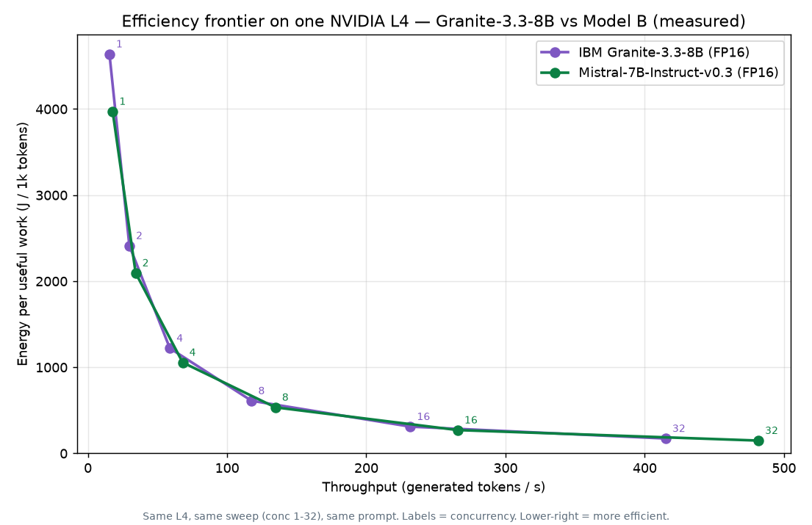
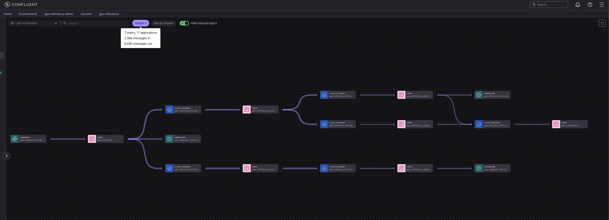

# Measured case study — IBM Granite 3.3-8B on NVIDIA L4

**100% real hardware telemetry**, captured live through the *same* Confluent Flink pipeline as the
synthetic quickstart. No synthetic values appear in this case study — every number below comes from a
real vLLM server + NVIDIA DCGM exporter, bridged to Kafka, and the raw data is attached for audit.

> Context: this models an **IBM Granite, served on open vLLM** workload — IBM Cloud itself
> documents deploying [granite-3.3-8b on a single NVIDIA L4](https://cloud.ibm.com/docs/solution-tutorials?topic=solution-tutorials-rhoai-deploy).

## What was measured

A real **Red Hat AI distribution of IBM Granite 3.3-8B Instruct**
([`RedHatAI/granite-3.3-8b-instruct`](https://huggingface.co/RedHatAI/granite-3.3-8b-instruct), FP16 —
Red Hat has not published an FP8 build for 3.3 yet) served by **vLLM** on a single **NVIDIA L4** GPU,
under a controlled closed-loop load (fixed-concurrency phases), with **NVIDIA DCGM** energy/utilization
telemetry and **vLLM** serving metrics streamed 1/s into `gpu_telemetry` and processed by the deployed
Flink statements (`flink/02_detect_anomalies.sql` etc.).

## Scope — what this is, and when it matters

This is a **reproducible reference** for measuring and governing GPU inference cost from real
telemetry. Two honest notes on scope:

- **For a one-off measurement of a single deployment, you don't need a streaming platform.** NVIDIA
  DCGM + a model server's `/metrics` + a short script will reproduce the numbers below — and we kept a
  no-GPU synthetic quickstart plus the committed raw data precisely so anyone can.
- **The pattern earns its keep at fleet scale:** continuous, governed, multi-deployment cost governance
  — consistent telemetry via Schema Registry, auditability via Stream Lineage, real-time detection and
  forecasting *inside* Flink (no separate model-serving infrastructure), and a closed action loop. That
  is what this project demonstrates end-to-end on Confluent Cloud for Apache Flink.

What we measured is a known principle made **precise, auditable, and reproducible**: at ~100 % GPU
utilization, energy per *useful* token still varied ~27× across batching regimes. **Utilization is a
misleading cost signal; energy-per-useful-work is the honest one.**

## Related work & positioning

- **[GuideLLM](https://github.com/vllm-project/guidellm)** (Red Hat / vLLM) and **[MLPerf
  Inference](https://mlcommons.org/benchmarks/inference-datacenter/)** (incl. the MLPerf Power
  methodology) benchmark serving throughput/latency — and power — **offline**, as a one-shot
  characterization run.
- **[NVIDIA DCGM](https://github.com/NVIDIA/DCGM)** exposes the energy/power counters this project
  consumes.
- **Delta:** those tools *characterize* a deployment offline. This project does **online, per-deployment
  cost governance in the data plane** — the same energy-per-useful-work KPI computed continuously over
  governed streams, with detection, forecasting, and a closed remediation loop, across a fleet. It is
  complementary to (not a replacement for) offline benchmarking: benchmark once with GuideLLM/MLPerf;
  *govern continuously* here.

## Results — the efficiency frontier (real, audited)

The headline KPI is **`joules_per_1k_tokens`** — GPU energy per 1,000 *useful* generated tokens (the
energy cost of useful work, not just utilization). We swept **fixed concurrency 1 → 32** (each level
held ≥ 3.5 min) and measured the KPI two independent ways (see *Rigor*):

| Concurrency | GPU util | GPU power | Throughput | **J/1k (power÷tput)** | J/1k (ΔE÷Δtok) |
|---|---|---|---|---|---|
| 1  | ~100 % | 71.9 W | 15.5 tok/s | **4 639** | 4 071 |
| 2  | ~100 % | 71.9 W | 29.8 tok/s | **2 413** | 2 561 |
| 4  | ~100 % | 71.9 W | 58.9 tok/s | **1 221** | 1 296 |
| 8  | ~100 % | 71.9 W | 117.6 tok/s | **611** | 589 |
| 16 | ~100 % | 72.0 W | 231.6 tok/s | **311** | 294 |
| 32 | ~100 % | 71.9 W | 415.0 tok/s | **173** | 152 |
| idle | ~0 % | 34.9 W | 0 | **NULL** | NULL |


How to read it:

- **The efficiency frontier.** Batching throughput scales ~linearly (15 → 415 tok/s) while power stays
  flat at the **L4 TDP (~72 W) across every loaded level**, so energy per useful token collapses
  **~27× (4 639 → 173 J/1k)**. Because power is constant, the frontier is essentially
  `J/1k ≈ TDP / throughput` — it is *throughput-driven*. That curve is the real, measured efficiency
  frontier for Granite-3.3-8B on an L4.
- **Utilization lies; energy-per-useful-work tells the truth.** GPU utilization was **~100 % at every
  loaded level** — yet the *cost* of that work ranged ~27×. A utilization dashboard calls conc=1 and
  conc=32 equally "busy"; only J/1k exposes that conc=1 wastes ~27× the energy per token.
- **Idle = maximum waste, and it's `NULL` on purpose.** Idle still drew **34.9 W** producing **zero**
  useful tokens — energy-per-useful-work is *undefined* (division by zero). `NULL` is the honest
  signal for "infinitely inefficient", not a gap.
- **The real number is higher than a back-of-envelope ~20-30 J/1k** — FP16 8B on an L4 peaks at ~415
  tok/s, not the thousands a faster accelerator would; `J/1k = power ÷ throughput`. The point is to
  *measure* per deployment, not estimate.

## Rigor — dual-method power, cross-run consistency, sanity

- **Two independent measurement methods agree.** Every point is computed both ways from the
  **append-only** `gpu_telemetry` topic ([`data/sweep_telemetry_raw.jsonl.gz`](data/sweep_telemetry_raw.jsonl.gz),
  5 356 records): **(i)** `mean(power_watts) / throughput` — *primary*, since instantaneous DCGM power
  is rock-steady at **71.9-72.0 W (the L4 TDP) at every level**; and **(ii)** the counter delta
  `Δenergy_mJ / Δtokens` — reported for transparency. The two **agree within ±13 %**; the spread in (ii)
  is jitter from DCGM's energy-counter update cadence over the interval, not a physical effect. We
  publish (i). `data/sweep_results.csv` + `plot.py` regenerate the plot.
- **Cross-run reproducibility.** conc=32 here gives **173 J/1k** (71.9 W ÷ 415 tok/s); an *independent
  earlier single run* measured 72.2 W ÷ 416 tok/s → **173 J/1k** — the same number from a separate
  deployment. Independent runs reproduce.
- **Sanity (not exclusion).** We sanity-check that interval power stays within the L4 power envelope
  (~72 W) and that J/1k is monotonic in concurrency with idle `NULL`. All six points are physically
  valid (power 71.9-72.0 W) and retained — no points are dropped.
- **In-pipeline cross-check.** `flink/02_detect_anomalies.sql` computes the identical `Δenergy/Δtokens`
  formula and emits the populated KPI live ([`data/anomalies_inpipeline.jsonl.gz`](data/anomalies_inpipeline.jsonl.gz),
  captured during the run). Its per-15 s windows carry the same DCGM-cadence noise as method (ii), so
  the published frontier uses the steadier method (i) over the retained raw topic.

## Limitations

Stated plainly, because honest scope is the point:

- **Single GPU, single model, two runs.** One NVIDIA L4, one `RedHatAI/granite-3.3-8b-instruct`
  (FP16 — FP8 not published for 3.3 at capture time), `--max-model-len 4096`, concurrency ≤ 32. The
  sweep is one run; conc=32 is corroborated by one independent earlier run. Not a large multi-GPU /
  multi-model statistical study.
- **Controlled synthetic load, not a production workload.** A closed-loop generator with a fixed
  prompt and `max_tokens=200` — it exercises the mechanism (batching efficiency, idle waste); it is
  *not* a representative production traffic mix.
- **Energy-counter cadence.** The DCGM energy counter updates coarsely relative to the bridge sampling,
  so the counter-delta method (ii) carries ±13 % jitter; the primary method (i) uses the steady
  instantaneous power reading.
- **The business-impact figures below are an illustrative projection**, not a measured production
  saving — see that section.
- **Comparative conc=32 has a short window.** In the Mistral-7B comparison run, the bridge stopped
  ~62 s into the conc=32 phase, so that single point rests on ~62 s (~250 samples) rather than the full
  ~215 s; the lower-concurrency points and Granite's full sweep are unaffected. The primary
  (instantaneous-power) method makes it robust, but the n is noted.
- **The waste detector is a heuristic, characterized honestly.** `WASTE_HIGH_UTIL` fires on high-util /
  low-useful-throughput windows (e.g. util ~96 % with near-zero useful tokens). On real hardware that is
  the low-concurrency regime; on the synthetic quickstart it fires on the equivalent high-util/low-token
  windows. It is a deterministic rule, not a learned model.
- **Cost note:** running the closed loop required raising the Flink compute pool to `max_cfu = 10` (the
  6th statement needed CFU headroom); CFUs are billed by usage and the environment was torn down
  immediately after capture.

## Reproduce it

```bash
# 1. VM: 1x L4 (g2-standard-8), Deep Learning VM image (CUDA driver preinstalled)
gcloud compute instances create granite-l4-casestudy --zone=us-central1-c \
  --machine-type=g2-standard-8 \
  --image-family=common-cu129-ubuntu-2204-nvidia-580 --image-project=deeplearning-platform-release \
  --maintenance-policy=TERMINATE --boot-disk-size=150GB --scopes=cloud-platform

# 2. On the VM (Docker + NVIDIA container toolkit): DCGM exporter + vLLM
docker run -d --gpus all --cap-add SYS_ADMIN -p 9400:9400 \
  nvcr.io/nvidia/k8s/dcgm-exporter:3.3.5-3.4.1-ubuntu22.04
docker run -d --gpus all -p 8000:8000 vllm/vllm-openai:latest \
  --model RedHatAI/granite-3.3-8b-instruct --served-model-name granite-3.3-8b-instruct \
  --max-model-len 4096 --gpu-memory-utilization 0.92

# 3. Deploy the Flink pipeline (same as the quickstart) and run the real-source bridge
uv run deploy
BOOTSTRAP_SERVERS=... KAFKA_API_KEY=... uv run bridge --rate-per-sec 1 \
  --model-id granite-3.3-8b-instruct --deployment-id inference-node-a

# 4. Drive a fixed-concurrency SWEEP (each level >=3.5 min, >=10 clean 15s windows):
#    IDLE -> conc 1 -> 2 -> 4 -> 8 -> 16 -> 32 -> IDLE; log phase epoch timestamps,
#    then audit data/sweep_telemetry_raw.jsonl.gz with the interval method (see plot.py / sweep_results.csv).
```

The bridge is [`src/gpu_efficiency_streaming/bridge.py`](../../src/gpu_efficiency_streaming/bridge.py)
(`uv run bridge`) — it maps vLLM + DCGM Prometheus metrics 1:1 onto the `gpu_telemetry` Avro contract;
no synthetic values.

## Comparison — Granite-3.3-8B vs Mistral-7B-Instruct-v0.3 on the same L4

To close the single-model limitation, we ran the **identical sweep** (same NVIDIA L4, same concurrency
phases 1→32, same prompt, same `max_tokens=200`, same bridge) against a second model —
[`mistralai/Mistral-7B-Instruct-v0.3`](https://huggingface.co/mistralai/Mistral-7B-Instruct-v0.3)
(Apache-2.0). Only the model changed.

| Concurrency | Granite-3.3-8B — J/1k | Mistral-7B-v0.3 — J/1k | Mistral throughput | Δ (Mistral vs Granite) |
|---|---|---|---|---|
| 1  | 4 639 | 3 972 | 17.8 tok/s  | −14 % |
| 2  | 2 413 | 2 096 | 34.3 tok/s  | −13 % |
| 4  | 1 221 | 1 056 | 68.1 tok/s  | −14 % |
| 8  | 611   | 535   | 134.7 tok/s | −12 % |
| 16 | 311   | 271   | 265.7 tok/s | −13 % |
| 32 | 173   | 149   | 481.6 tok/s | −14 % |



Honest reading:

- **Mistral-7B-v0.3 is ~12-14 % more energy-efficient per token at every concurrency level** on this L4
  (e.g. 149 vs 173 J/1k at conc=32). Both models draw the same ~72 W TDP, so the difference is
  **throughput**: the smaller 7B model sustains more tokens/s (481 vs 415 at conc=32) than the 8B, and
  `J/1k = power ÷ throughput`.
- **This is a model-size effect (7B vs 8B), not an architecture verdict.** The comparison is
  apples-to-apples on *infrastructure* (same GPU, sweep, prompt, pipeline) but the models differ in
  size; a fair "which architecture is more efficient" study would size-match. The point here is that
  the KPI **measures real, model-specific efficiency differences** — exactly what a platform team needs
  to choose and right-size a model.
- Both frontiers are computed by the same dual-method audit; raw data:
  [`data/sweep_telemetry_modelb.jsonl.gz`](data/sweep_telemetry_modelb.jsonl.gz) +
  [`data/sweep_results_modelb.csv`](data/sweep_results_modelb.csv).

### Closed-loop governance (live)

The deployed pipeline closes the loop from detection to a remediation recommendation, entirely in
Flink SQL:

- **`flink/08_waste_high_util.sql`** — a "utilization-lies" waste detector. It flags windows with
  **high GPU utilization but low *useful* throughput** (`avg_gpu_util >= 90` and `gen_tokens_win <=
  1000`, i.e. < ~66 tok/s over the 15 s window) → `gpu_efficiency_waste`. On the measured hardware this
  is the **low-concurrency regime** (util pinned ~100 % while throughput is a fraction of peak — the
  exact pattern the frontier exposed); on the synthetic quickstart it fires on the equivalent
  high-util / low-token windows (e.g. util ~96 % with near-zero useful tokens).
- **`flink/09_remediation.sql`** — a **rule-based** remediation recommender (deterministic `CASE`
  rules, **no LLM** — a reference aligned with the Confluent *Streaming Agents* pattern). It consumes
  the governed signals (idle/saturation alerts + high-util waste) and emits, per deployment, a
  `recommended_action` and an *illustrative* `est_reclaimable_usd_per_mo`. Real captured rows in
  [`evidence/remediation-sample.txt`](evidence/remediation-sample.txt), e.g. `WASTE_HIGH_UTIL → "Raise
  batch concurrency or right-size the model" → $155.25/mo` and `SATURATION → "Scale out or rate-limit"
  → $0`.

### Live pipeline evidence

Captured **live** from the Confluent Cloud environment during the run — a full component-by-component
walkthrough (Stream Lineage, the topics, each Flink statement, the S3 connector, the remediation
output, and Schema Registry `BACKWARD`) is in **[`pipeline/PIPELINE.md`](../../pipeline/PIPELINE.md)**.



*Stream Lineage (captured live): one producer fans out into detect→alerts→S3, detect→waste→remediation,
forecast→capacity→S3, and a raw-archive S3 sink. CLI evidence (Schema Registry `BACKWARD`, the
`gpu_telemetry-value` schema, topic config) is in [`evidence/`](evidence/).*

## Business impact — real-time GPU cost governance

GPU inference is among the most expensive line items in an AI platform, and a large share is spent on
GPUs that are **allocated but idle or under-batched** — exactly what this run reproduced (idle drawing
26.3 W for zero useful output; low-concurrency costing 7× the energy per token).

A g2-standard-8 (1× L4) is **≈ $0.85/hr on-demand ≈ $623/GPU/month**
([GCP Compute pricing](https://cloud.google.com/products/compute/gpus-pricing); corroborated by public
calculators). Reclaimable spend scales with the **idle/low-efficiency fraction `F`** that this pipeline
*measures per deployment*:

> **Illustrative projection** (mechanism, not a measured production figure): if a fleet runs at
> `F = 40%` idle/low-efficiency time, reclaimable ≈ `$623 × 0.40 ≈ $249 / GPU / month`, or
> **≈ $300k/yr on a 100-GPU fleet**. The honest contribution of this project is not this number — it is
> that it **measures the real `F`** (and the J/1k that drives it) per deployment, in real time, so the
> savings are grounded rather than guessed.

This reframes the project from *monitoring* to **real-time GPU cost governance**: the `ML_FORECAST`
capacity-risk branch flags `PREDICTED_IDLE` *before* the waste is incurred (cost → faster
right-sizing), and the `SATURATION` alerts protect customer experience under load.

**Measured unit economics** (price × *measured* throughput — this part is measured, not projected). At
the same $0.8508/hr node, cost-per-useful-work mirrors the energy frontier:

| | Granite-3.3-8B (peak) | Mistral-7B-v0.3 (peak) |
|---|---|---|
| Throughput | 415 tok/s | 481.6 tok/s |
| **$ / 1M tokens (at peak batching)** | **≈ $0.57** | **≈ $0.49** |
| $ / 1M tokens (conc=1, under-batched) | ≈ $15.3 | ≈ $13.3 |

So the same dollar buys ~**27× more useful tokens** at peak batching than under-batched — the cost
frontier *is* the energy frontier. (Per-1M-token figures = `price_per_hr / (tok/s × 3600) × 1e6`; the
notebook recomputes them from the committed data.)

**Confluent-native & time-to-market.** The entire governance layer is **Flink SQL deployed in minutes**
(`uv run deploy`) — ARIMA/STL detection and forecasting run **in the data plane**, with **no separate
model-serving or monitoring stack** to stand up, and the loop is closed by a rule-based remediation
recommender aligned with the Confluent Streaming Agents pattern. That is the time-to-market argument:
governed, real-time GPU cost control without assembling Prometheus + scripts + a warehouse + an
alerting + an action tier.

## Provenance

| Field | Value |
|---|---|
| Model | `RedHatAI/granite-3.3-8b-instruct` (IBM Granite 3.3-8B Instruct, Red Hat AI distribution) |
| Quantization | FP16 (BF16 weights; FP8 not published for 3.3 at capture time) |
| Server | `vllm/vllm-openai:latest` (pulled 2026-06-15), OpenAI-compatible, `--max-model-len 4096` |
| GPU | NVIDIA L4 24 GB, `GPU-2e9a88f9-0e65-771b-d391-e09984261540`, driver 580.159.03 |
| Host | GCE `g2-standard-8`, us-central1-c |
| Telemetry | NVIDIA DCGM exporter 3.3.5 + vLLM Prometheus `/metrics`, bridged 1/s |
| Pipeline | Confluent Cloud for Apache Flink — `flink/02,03,05,07` |
| Captured | 2026-06-15 |
| Raw data | [`data/sweep_telemetry_raw.jsonl.gz`](data/sweep_telemetry_raw.jsonl.gz) (5 356 records) · [`data/anomalies_inpipeline.jsonl.gz`](data/anomalies_inpipeline.jsonl.gz) · [`data/sweep_results.csv`](data/sweep_results.csv) |

## Roadmap / Future directions

This is an open reference; the following are natural extensions (not yet implemented) that line up
with where the platform is heading:

- **LLM-assisted remediation in the data plane** — evolve the rule-based remediation recommender into
  an in-Flink `AI_COMPLETE` / model-inference call that reasons over an alert plus deployment context
  to draft a remediation, fitting the Confluent Streaming Agents pattern. *(Today's recommender is
  deterministic and rule-based, on purpose.)*
- **Lakehouse for historical efficiency analysis (Tableflow → Apache Iceberg)** — materialize the
  governed topics as Iceberg tables for long-horizon trend analysis, regression tracking, and cost
  reporting, with no separate ETL.
- **Fleet matrix (multi-GPU, multi-model, multi-quantization)** — extend the concurrency sweep across
  GPU classes (e.g., L4 / L40S / A100 / H100) and model sizes/quantizations (FP16 / FP8) to map an
  efficiency frontier per `(model, GPU)`. Requires validating per-deployment partitioning
  (`PARTITION BY deployment_id`) for the detection/forecast statements.
- **Production-traffic validation** — replace the closed-loop synthetic generator with mirrored real
  traffic to measure the idle / low-efficiency fraction `F` on representative workloads (today's
  business figures are an illustrative projection grounded in the measured per-token unit economics).
- **Calibrated decision bounds** — attach confidence/uncertainty bands to the forecast so
  `PREDICTED_IDLE` actions carry a calibrated risk, not a point estimate.
- **Closed-loop actuation with guardrails** — connect remediation recommendations to an actuator
  (e.g., scale-to-zero / autoscaler) via a Streaming Agent, moving from *recommend* to *act* behind
  human-approval or policy guardrails.

*Built by **Lutflow** — real-time AI infrastructure governance. [lutflow.dev](https://lutflow.dev)*

## References

- [vLLM production metrics](https://docs.vllm.ai/en/latest/usage/metrics.html) ·
  [NVIDIA DCGM exporter](https://github.com/NVIDIA/dcgm-exporter)
- [Red Hat AI Inference Server (vLLM) + GuideLLM benchmarking](https://developers.redhat.com/articles/2025/12/24/how-deploy-and-benchmark-vllm-guidellm-kubernetes)
- [IBM Research — efficient inference (speculative decoding), arXiv:2404.19124](https://arxiv.org/abs/2404.19124)

*Trademarks: IBM® and Granite are trademarks of IBM Corp.; NVIDIA® and DCGM are trademarks of NVIDIA
Corporation; Red Hat® is a trademark of Red Hat, Inc. Independent, unaffiliated project.*
