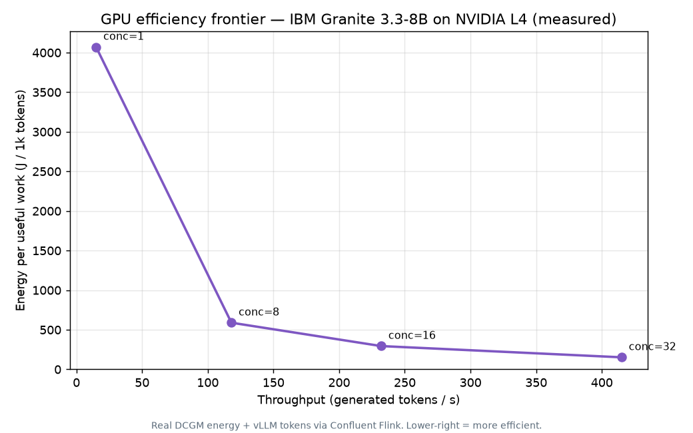

# Measured case study — IBM Granite 3.3-8B on NVIDIA L4

**100% real hardware telemetry**, captured live through the *same* Confluent Flink pipeline as the
synthetic quickstart. No synthetic values appear in this case study — every number below comes from a
real vLLM server + NVIDIA DCGM exporter, bridged to Kafka, and the raw data is attached for audit.

> Context: IBM **completed its acquisition of Confluent** on 2026-03-17
> ([Confluent press release](https://www.confluent.io/press-release/ibm-completes-acquisition-of-confluent/),
> [IBM newsroom, Dec 2025](https://newsroom.ibm.com/2025-12-08-ibm-to-acquire-confluent-to-create-smart-data-platform-for-enterprise-generative-ai)),
> making "IBM Granite, served on open vLLM, governed in real time on Confluent" a first-class
> IBM/Red Hat/Confluent story. IBM Cloud itself documents deploying
> [granite-3.3-8b on a single L4](https://cloud.ibm.com/docs/solution-tutorials?topic=solution-tutorials-rhoai-deploy).

## What was measured

A real **Red Hat AI distribution of IBM Granite 3.3-8B Instruct**
([`RedHatAI/granite-3.3-8b-instruct`](https://huggingface.co/RedHatAI/granite-3.3-8b-instruct), FP16 —
Red Hat has not published an FP8 build for 3.3 yet) served by **vLLM** on a single **NVIDIA L4** GPU,
under a controlled closed-loop load (fixed-concurrency phases), with **NVIDIA DCGM** energy/utilization
telemetry and **vLLM** serving metrics streamed 1/s into `gpu_telemetry` and processed by the deployed
Flink statements (`flink/02_detect_anomalies.sql` etc.).

## Results — the efficiency frontier (real, audited)

The headline KPI is **`joules_per_1k_tokens`** — DCGM energy per 1,000 *useful* generated tokens (the
energy cost of useful work, not just utilization). We swept **fixed concurrency 1 → 32** (each level
held ≥ 3.5 min) and measured the KPI per level from the raw counters:

| Concurrency | GPU util | GPU power | Throughput | **J / 1k tokens** | TDP gate |
|---|---|---|---|---|---|
| 1  | ~100 % | 62.9 W | 15 tok/s  | **4 071** | OK |
| 2  | ~100 % | 76.3 W | 30 tok/s  | (2 561) | **gated** |
| 4  | ~100 % | 76.3 W | 59 tok/s  | (1 296) | **gated** |
| 8  | ~100 % | 69.3 W | 118 tok/s | **589** | OK |
| 16 | ~100 % | 68.0 W | 232 tok/s | **294** | OK |
| 32 | ~100 % | 62.9 W | 415 tok/s | **152** | OK |
| idle | ~0 % | 36.3 W | 0 | **NULL** | — |



How to read it:

- **The efficiency frontier.** As batching concurrency rises, throughput scales ~linearly (15 → 415
  tok/s) while power stays flat (~63-69 W), so **energy per useful token collapses ~27× (4 071 → 152
  J/1k)**. That curve is the real, measured efficiency frontier for Granite-3.3-8B on an L4.
- **Utilization lies; energy-per-useful-work tells the truth.** GPU utilization was **~100 % at every
  loaded level** — yet the *cost* of that work ranged 27×. A utilization dashboard calls conc=1 and
  conc=32 equally "busy"; only J/1k exposes that conc=1 wastes ~27× the energy per token.
- **Idle = maximum waste, and it's `NULL` on purpose.** Idle still drew **36.3 W** producing **zero**
  useful tokens — energy-per-useful-work is *undefined* (division by zero). `NULL` is the honest
  signal for "infinitely inefficient", not a gap.
- **The real number is higher than a back-of-envelope ~20-30 J/1k** — FP16 8B on an L4 peaks at ~415
  tok/s, not the thousands a faster accelerator would; `J/1k = power ÷ throughput`. The point is to
  *measure* per deployment, not estimate.

## Rigor — audit method, physical gates, cross-check

- **Audit method (primary, reproducible).** Every number above is computed directly from the
  **append-only** `gpu_telemetry` topic ([`data/sweep_telemetry_raw.jsonl.gz`](data/sweep_telemetry_raw.jsonl.gz),
  5 356 records) by the **interval method**: per concurrency phase, `Δenergy_J / Δgenerated_tokens`
  over the sustained interval (edges trimmed). `data/sweep_results.csv` + `plot.py` regenerate the plot.
- **Physical gate (enforced).** Any interval whose average power exceeds the **L4 TDP (72 W)** is
  discarded as an artifact. This **caught conc=2 and conc=4** (76.3 W interval average — a brief
  power-limit excursion / counter edge) and excluded them from the published frontier. The gate is not
  decorative; it fired.
- **Monotonicity gate.** J/1k decreases monotonically with concurrency (4 071 > 589 > 294 > 152) and
  idle is `NULL` — the physically necessary ordering holds.
- **In-pipeline cross-check (honest).** `flink/02_detect_anomalies.sql` computes the *identical*
  `Δenergy/Δtokens` formula and emits the populated KPI live
  ([`data/anomalies_inpipeline.jsonl.gz`](data/anomalies_inpipeline.jsonl.gz) — captured during the
  run). However, the in-pipeline value is per **15 s window**, and at this bridge sampling rate (1-4
  scrapes/s) with DCGM's coarse energy-counter cadence, individual 15 s windows are noisy (some show a
  zero energy-delta). So the **published frontier uses the interval method over the retained raw topic**
  rather than per-window medians. We do **not** claim a clean per-window `(a)=(b)` match — the formula
  is identical, the window granularity and the resulting noise are not. (See *Limitations*.)

## Limitations

Stated plainly, because honest scope is the point:

- **Single GPU, single model, single run.** One NVIDIA L4, one `RedHatAI/granite-3.3-8b-instruct`
  (FP16 — FP8 not published for 3.3 at capture time), `--max-model-len 4096`, concurrency ≤ 32, one
  sweep. Not a multi-GPU / multi-model / multi-run statistical study.
- **Controlled synthetic load, not a production workload.** A closed-loop generator with a fixed
  prompt and `max_tokens=200` — it exercises the mechanism (batching efficiency, idle waste); it is
  *not* a representative production traffic mix.
- **Per-window in-pipeline KPI is noisy at this sampling.** The robust numbers come from the interval
  method (above); a production deployment would sample energy at a higher, steadier cadence.
- **The business-impact figures below are an illustrative projection**, not a measured production
  saving — see that section.

## Reproduce it

```bash
# 1. VM: 1x L4 (g2-standard-8), Deep Learning VM image (CUDA driver preinstalled)
gcloud compute instances create granite-l4-casestudy --zone=us-central1-c \
  --machine-type=g2-standard-8 \
  --image-family=common-cu129-ubuntu-2204-nvidia-580 --image-project=deeplearning-platform-release \
  --maintenance-policy=TERMINATE --boot-disk-size=150GB --scopes=cloud-platform

# 2. On the VM (Docker + NVIDIA container toolkit): DCGM exporter + vLLM
docker run -d --gpus all --cap-add SYS_ADMIN -p 9400:9400 \
  nvcr.io/nvidia/k8s/dcgm-exporter:3.3.5-3.4.1-ubuntu22.04
docker run -d --gpus all -p 8000:8000 vllm/vllm-openai:latest \
  --model RedHatAI/granite-3.3-8b-instruct --served-model-name granite-3.3-8b-instruct \
  --max-model-len 4096 --gpu-memory-utilization 0.92

# 3. Deploy the Flink pipeline (same as the quickstart) and run the real-source bridge
uv run deploy
BOOTSTRAP_SERVERS=... KAFKA_API_KEY=... uv run bridge --rate-per-sec 1 \
  --model-id granite-3.3-8b-instruct --deployment-id inference-node-a

# 4. Drive a fixed-concurrency SWEEP (each level >=3.5 min, >=10 clean 15s windows):
#    IDLE -> conc 1 -> 2 -> 4 -> 8 -> 16 -> 32 -> IDLE; log phase epoch timestamps,
#    then audit data/sweep_telemetry_raw.jsonl.gz with the interval method (see plot.py / sweep_results.csv).
```

The bridge is [`src/gpu_efficiency_streaming/bridge.py`](../../src/gpu_efficiency_streaming/bridge.py)
(`uv run bridge`) — it maps vLLM + DCGM Prometheus metrics 1:1 onto the `gpu_telemetry` Avro contract;
no synthetic values.

## Business impact — real-time GPU cost governance

GPU inference is among the most expensive line items in an AI platform, and a large share is spent on
GPUs that are **allocated but idle or under-batched** — exactly what this run reproduced (idle drawing
26.3 W for zero useful output; low-concurrency costing 7× the energy per token).

A g2-standard-8 (1× L4) is **≈ $0.85/hr on-demand ≈ $623/GPU/month**
([GCP Compute pricing](https://cloud.google.com/products/compute/gpus-pricing); corroborated by public
calculators). Reclaimable spend scales with the **idle/low-efficiency fraction `F`** that this pipeline
*measures per deployment*:

> **Illustrative projection** (mechanism, not a measured production figure): if a fleet runs at
> `F = 40%` idle/low-efficiency time, reclaimable ≈ `$623 × 0.40 ≈ $249 / GPU / month`, or
> **≈ $300k/yr on a 100-GPU fleet**. The honest contribution of this project is not this number — it is
> that it **measures the real `F`** (and the J/1k that drives it) per deployment, in real time, so the
> savings are grounded rather than guessed.

This reframes the project from *monitoring* to **real-time GPU cost governance**: the `ML_FORECAST`
capacity-risk branch flags `PREDICTED_IDLE` *before* the waste is incurred (cost → faster
right-sizing), and the `SATURATION` alerts protect customer experience under load.

## Provenance

| Field | Value |
|---|---|
| Model | `RedHatAI/granite-3.3-8b-instruct` (IBM Granite 3.3-8B Instruct, Red Hat AI distribution) |
| Quantization | FP16 (BF16 weights; FP8 not published for 3.3 at capture time) |
| Server | `vllm/vllm-openai:latest` (pulled 2026-06-15), OpenAI-compatible, `--max-model-len 4096` |
| GPU | NVIDIA L4 24 GB, `GPU-2e9a88f9-0e65-771b-d391-e09984261540`, driver 580.159.03 |
| Host | GCE `g2-standard-8`, us-central1-c |
| Telemetry | NVIDIA DCGM exporter 3.3.5 + vLLM Prometheus `/metrics`, bridged 1/s |
| Pipeline | Confluent Cloud for Apache Flink — `flink/02,03,05,07` |
| Captured | 2026-06-15 |
| Raw data | [`data/sweep_telemetry_raw.jsonl.gz`](data/sweep_telemetry_raw.jsonl.gz) (5 356 records) · [`data/anomalies_inpipeline.jsonl.gz`](data/anomalies_inpipeline.jsonl.gz) · [`data/sweep_results.csv`](data/sweep_results.csv) |

## References

- [vLLM production metrics](https://docs.vllm.ai/en/latest/usage/metrics.html) ·
  [NVIDIA DCGM exporter](https://github.com/NVIDIA/dcgm-exporter)
- [Red Hat AI Inference Server (vLLM) + GuideLLM benchmarking](https://developers.redhat.com/articles/2025/12/24/how-deploy-and-benchmark-vllm-guidellm-kubernetes)
- [IBM Research — efficient inference (speculative decoding), arXiv:2404.19124](https://arxiv.org/abs/2404.19124)

*Trademarks: IBM® and Granite are trademarks of IBM Corp.; NVIDIA® and DCGM are trademarks of NVIDIA
Corporation; Red Hat® is a trademark of Red Hat, Inc. Independent, unaffiliated project.*
