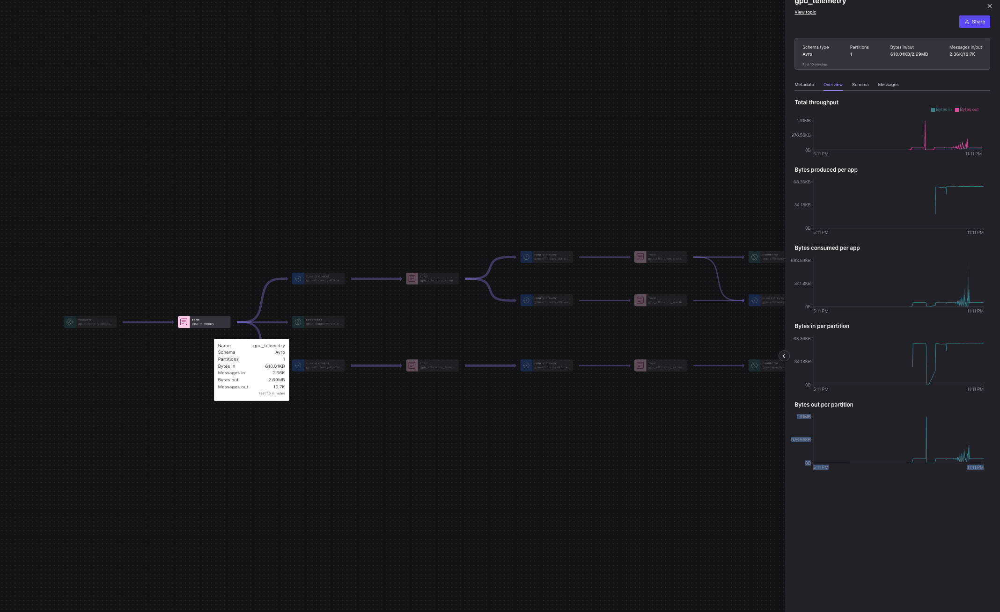
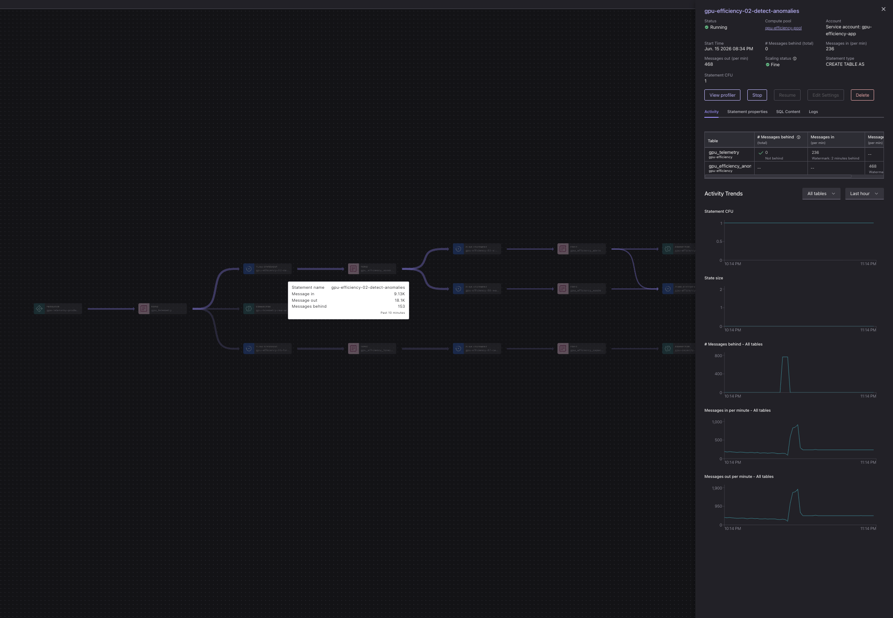
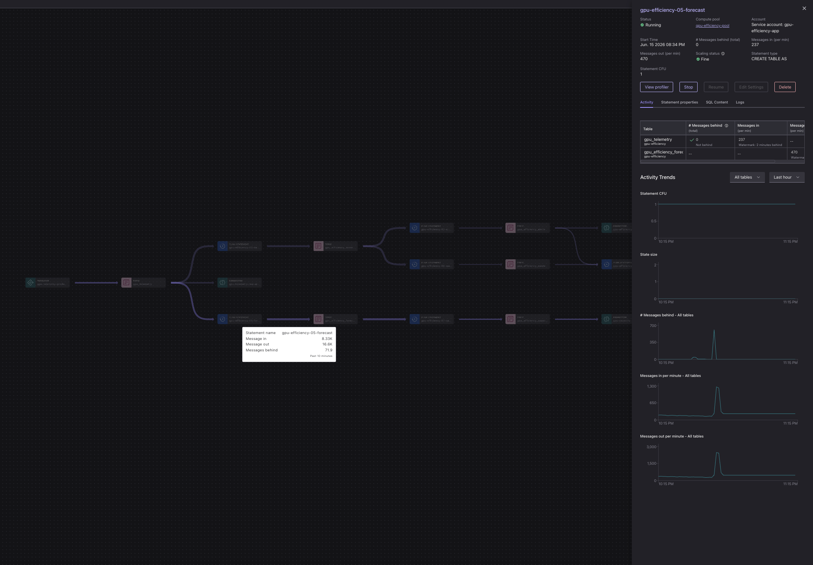
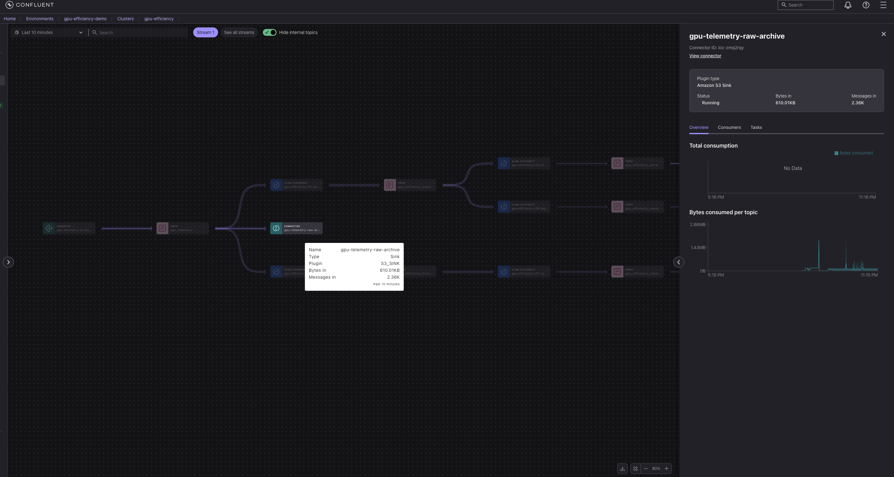
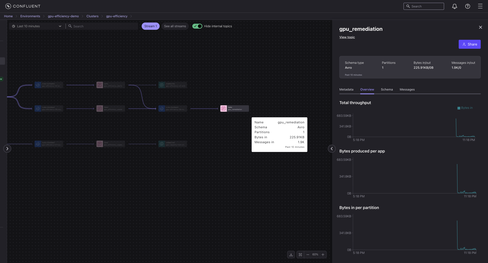
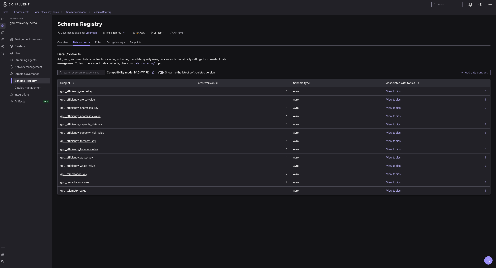

# Pipeline walkthrough — components on Confluent Cloud

A guided tour of the **real-time GPU cost-governance pipeline** as it runs on Confluent Cloud for
Apache Flink. Every image below is **captured live** from an actual run (the data plane processing real
GPU telemetry), and shows a single component: what it is, why it's there, and how it's used.

> The data flows: **producer/bridge → `gpu_telemetry` → Flink (detect · forecast · waste) →
> alerts/waste → remediation → Amazon S3 sinks**, governed by Schema Registry and visualized in Stream
> Lineage. ML runs *inside* Flink — there is no separate model-serving tier to operate.

---

## 1. The whole pipeline — Stream Lineage (the closed governance loop)

Confluent **Stream Lineage** renders the end-to-end topology automatically. One producer fans out into
three governed paths, and the detection path closes a loop into a remediation recommender:

| # | Component | Type | What it does | Why it matters |
|---|---|---|---|---|
| 1 | `gpu-telemetry-producer` | Producer / bridge | Maps live NVIDIA DCGM + vLLM metrics 1:1 onto an Avro contract | the real source of truth |
| 2 | `gpu_telemetry` | Topic (Avro) | The governed telemetry stream | one schema, many consumers |
| 3 | `gpu-efficiency-02-detect-anomalies` | Flink (`CREATE TABLE AS`) | `ML_DETECT_ANOMALIES` (ARIMA/STL) + the `joules_per_1k_tokens` KPI | anomaly detection *in the data plane* |
| 4 | `gpu_efficiency_anomalies` | Topic | Windowed efficiency + anomaly flags | feeds alerts and the waste detector |
| 5 | `gpu-efficiency-03-alerts` | Flink | Projects `IDLE_WASTE` / `SATURATION` alerts | actionable signals |
| 6 | `gpu-efficiency-08-waste-high-util` | Flink | "Utilization-lies" detector: high util **and** low useful throughput → `WASTE_HIGH_UTIL` | the waste a utilization dashboard hides |
| 7 | `gpu-efficiency-09-remediation` | Flink | Rule-based remediation recommender (reference-aligned with Confluent Streaming Agents; **no LLM**) | closes the loop: detect → recommend |
| 8 | `gpu-efficiency-05-forecast` | Flink | `ML_FORECAST` (h=1) on the efficiency signal | anticipates demand |
| 9 | `gpu-efficiency-07-capacity-risk` | Flink | Flags `PREDICTED_IDLE` *before* the waste is incurred | proactive cost control |
| 10 | S3 sinks (`alerts`, `capacity-risk`, `raw-archive`) | Connectors (Amazon S3 Sink) | Persist alerts, capacity risk, and raw telemetry | durable audit / downstream |

---

## 2. Governed contract — the `gpu_telemetry` topic

The source topic is **Avro**, registered in **Schema Registry**. Every producer and every Flink
statement reads/writes against this one contract, so the whole fleet's telemetry is consistent and
evolvable (compatibility is `BACKWARD`).

---

## 3. Anomaly detection *inside* Flink — `ML_DETECT_ANOMALIES`

This is a managed **`CREATE TABLE AS`** Flink statement (status **Running**, CFU shown). It runs
Confluent's built-in `ML_DETECT_ANOMALIES` and computes the `joules_per_1k_tokens` KPI per window —
**no separate model-serving infrastructure**. This is the modern Confluent stream-processing engine
(Flink), not legacy ksqlDB.

---

## 4. Forecasting — `ML_FORECAST`

A second Flink statement runs `ML_FORECAST` on the efficiency signal; its output feeds the capacity-risk
statement that raises `PREDICTED_IDLE` **before** the waste happens — proactive, not reactive.

---

## 5. Durable persistence — Amazon S3 Sink connector

Fully-managed **Amazon S3 Sink** connectors (status **Running**) persist the governed streams — alerts,
capacity risk, and a raw telemetry archive — with no custom consumer code.

---

## 6. The loop closes — `gpu_remediation`

The remediation statement writes, per deployment, a **recommended action** plus an *illustrative*
reclaimable-cost estimate to the `gpu_remediation` topic (here receiving ~1.9K recommendations).
Deterministic `CASE` rules — reference-aligned with the **Confluent Streaming Agents** pattern
(investigate → decide → act); **no LLM**. Example rows (e.g.
`WASTE_HIGH_UTIL → "Raise batch concurrency or right-size the model"`) are committed in
[`evidence/remediation-sample.txt`](../case-studies/granite-3.3-8b-l4/evidence/remediation-sample.txt).
The product value is measuring the *real* reclaimable fraction per deployment, in real time.

## 7. Stream Governance — Schema Registry & data contracts

Every topic is backed by a **governed Avro data contract** in **Schema Registry**, with **`BACKWARD`
compatibility** enforced. Each stage registers its own key/value subjects — telemetry, anomalies,
alerts, waste, remediation, forecast, capacity-risk — so schemas can evolve safely and every consumer
reads a known shape. This is the governance layer that makes the whole pipeline auditable.

---

*Captured live from a real Confluent Cloud run; environment/IDs are ephemeral. See the
[measured case study](case-studies/granite-3.3-8b-l4/README.md) for the efficiency-frontier results and raw data.*

*Trademarks: Confluent® is a trademark of Confluent, Inc.; NVIDIA® and DCGM of NVIDIA Corporation;
IBM® and Granite of IBM Corp.; Amazon S3 of Amazon.com, Inc. Independent, unaffiliated project.*
